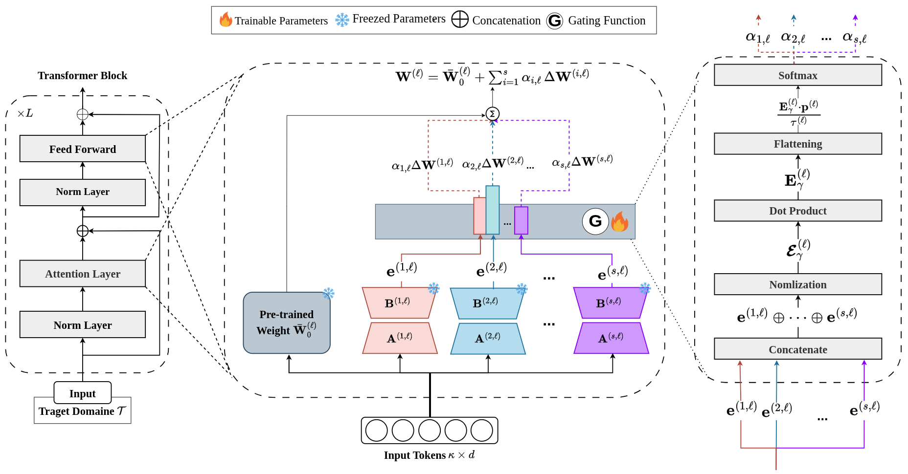

<h1 align="center">
  <i>Low-Rank Expert Merging for Multi-Source Domain Adaptation in Person Re-Identification</i>
</h1>

  <a href="https://www.linkedin.com/in/taha-mustapha-nehdi-240585203/" target='_blank'>Taha Mustapha Nehdi</a>,&nbsp;
  <a href="https://www.linkedin.com/in/nairouz-mrabah-b48162101/" target='_blank'>Nairouz Mrabah</a>,&nbsp;
  <a href="https://www.linkedin.com/in/atif-belal-15779821a/" target='_blank'>Atif Belal</a>,&nbsp;
  <a href="https://www.linkedin.com/in/marco-pedersoli-50677321b/" target='_blank'>Marco Pedersoli</a>,&nbsp;
  <a href="https://www.linkedin.com/in/eric-granger-4062324/" target='_blank'>Eric Granger </a>,&nbsp;
   
  Quebec University  
  École de technologie supérieure (ÉTS)  
  📧 Primary Contact: taha-mustapha.nehdi.1@ens.etsmtl.ca

  
  

## :mag: Overview

**TL; DR.** We propose SAGE-reID, a source-free multi-source domain adaptation framework for person re-identification based on gated LoRA experts. It first learns lightweight source-specific LoRA adapters without accessing source data during adaptation, then uses a small gating network to dynamically merge these experts while keeping the backbone fixed, achieving state-of-the-art accuracy with <2% extra parameters on Market-1501, DukeMTMC-reID, and MSMT17.

## :fire: News
- **2025.10.06**: Our paper is accepted by WACV 2026 :tada: :tada:. The revised paper and a more efficient codebase will be released in December. Almost there :nerd_face: ~

- **2025.08.09**: The first version of our paper is released at [arXiv:2508.06831v1](https://arxiv.org/abs/2508.06831)  :pushpin:.

## :dash: Quick Start
- See [INSTALL.md](./docs/INSTALL.md) for instructions of installing required components.

Code is under arrangment and preparation and it will be public soon 
